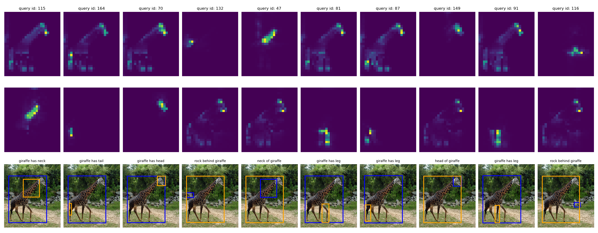

# RelTR: End-to-End Scene Graph Generation with Transformers

We provide the inference code which is entirely implemented in Pytorch in the supplementary. The code of training and evaluation will be released after publication. 

## Installation
It is very easy to configure the RelTR environment. We strongly recommend running the code on Linux system. Python=3.6, pytorch=1.6 and matplotlib are used in our code.
Please configure the environment as follows:
```
# create a conda environment 
conda create -n reltr python=3.6
conda activate reltr

# install packages
conda install pytorch==1.6.0 torchvision==0.7.0 cudatoolkit=10.1 -c pytorch
conda install matplotlib
```
# Pretrained Model
Please download the anonymous version of the pretrained RelTR model on the Visual Genome dataset with the link:
https://drive.google.com/file/d/1id6oD_iwiNDD6HyCn2ORgRTIKkPD3tUD/view

and put it under 
```
models/checkpoint0149.pth
```
## Usage
You can infer an image with the command:
```
python inference.py --img_path $IMAGE_PATH
```
We provide 5 images from VG dataset and 1 image from internet (Please use it only for testing, we do not own the copyright). You can infer the first VG image with:
```
python inference.py --img_path images/vg1.jpg
```
The result is as follows. The 1st/2nd row is the subject/object attention heat map while the 3rd row shows predicted triplets. Only top-10 confident predictions (and scores of subject, object and predicate>0.3) are shown. For clear demonstration, the attention heatmaps are not overlapped on the predictions as we did in the paper.

